# Facial Gender Recognition

## Introduction

This project is related to the CSE455 Computer Vision course at the University of Washington.
Through this project, we aim to enhance our code from lab5 to learn image patterns, enabling us to accurately recognize and classify the gender depicted in the images. 
For the sake of simplicity in this assignment, we have only classified the images based on the binary biological sexes, male and female. 
In cases where it was difficult to differentiate, the images were classified as the closest sex according to the experimenter's bias.

**Author: Young You (cuperido@uw.edu)**


## Preparing dataset

To train and test images, We searched for face images and found a dataset suitable for machine learning on Kaggle.
The dataset contains a total of 7,219 images. 
However, data cleaning was necessary before use due to the presence of numerous duplicated images and excessively large-size images.
Additionally, we needed to classify the gender and assign the corresponding gender name to each image's filename. 
As a result, we successfully prepared 1,000 men's and 1000 women's facial images, as illustrated below. 
We randomly mixed the images and allocated 1500 of them for training purposes and the remaining 500 for testing.

<figure>
    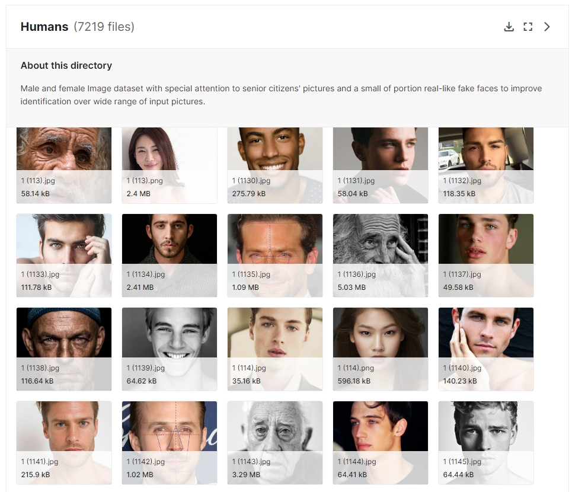
    <figcaption><i>Fig1. Kaggle Source Dataset: https://www.kaggle.com/datasets/ashwingupta3012/human-faces</i></figcaption>
</figure>

<figure>
    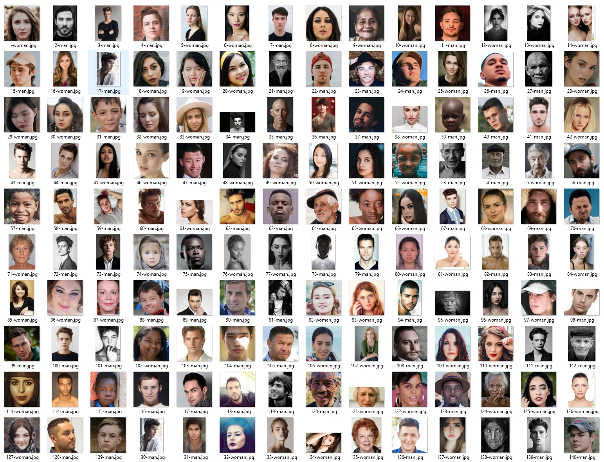
    <figcaption><i>Fig2. We classified proper images by gender and renamed them accordingly. The images were saved in the '/v1' folder.</i></figcaption>
</figure>


## First training data with the UWImg code

The initial purpose of this experiment was to improve the code from UWImg. 
We began by attempting to train using the following existing parameters from lab5 as a starting point.

```python
def neural_net(inputs, outputs):
    l = [make_layer(inputs, 64, RELU),
         make_layer(64, 32, RELU),
         make_layer(32, outputs, SOFTMAX)]
    return make_model(l)

print("loading data...")
train = load_classification_data(b"v1/v1.train", b"v1/labels.txt", 1)
test = load_classification_data(b"v1/v1.test", b"v1/labels.txt", 1)

batch = 128
iters = 1000
rate = 0.1
momentum = 0.9
decay = 0.01
```
Unfortunately, the testing did not go smoothly.
First, a crash error occurred continuously while reading the image files.
In order to find the problematic part, based on GDB and console logs, we have found that the lab5 code fails to read the width, height, and color type of specific file and causes a crash.
This outcome was expected since our lab5 assumed that the width and height of the images were identical in RGB channels.
Consequently, we incorporated a data cleaning step to modify all images to a size of 256x256 in RGB channels with Jpeg format.

```shell
Loading v1/train/1-woman.jpg
Loading v1/train/2-man.jpg
Loading v1/train/3-man.jpg
Loading v1/train/4-man.jpg.
Loading v1/train/5-woman.jpg
...
./hw: line 3: 211451 Killed     python uwlab.py
```

Despite repeatedly adjusting the image size and format, and continuing with testing, the issue this time was the training speed.
It was too slow that training did go well.
It took 15 seconds to train one image file, so it was expected to take 6 hours to train 1,500 images prepared.
Also when it progressed for about 20 minutes, the process was forced to terminate with an out-of-memory error.
```shell
000000: Loss: 1.028133
000001: Loss: 5.773959
000002: Loss: 1.205055
000003: Loss: 14.354274
...
000090: Loss: -nan
./hw: line 3: 211682 Killed     python uwlab.py
```


## Trial and error, and debugging
Ultimately, we had to resize all images to 128x128.
Additionally, we also decided to temporarily host an Azure Ubuntu OS environment with 8 CPUs and 64 RAM for faster computation.
Thanks to the smaller image size and faster calculations, the processing time for one image has now been reduced to around 1 seconds per image, and there are no longer any crashes resulting from insufficient memory.

<figure>
    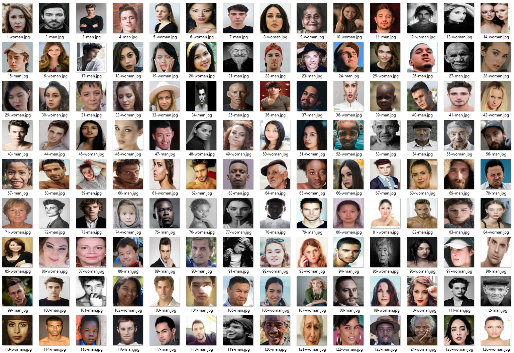
    <figcaption><i>Fig3. We resized all images to 128x128 and changed the color mode to RGB. The images were saved in the '/v1m' folder.</i></figcaption>
</figure>

However, it doesn't be trained, and after a certain point, it kept showing `-nan`.
Although we reduced the `rate` parameter and even manipulated all the parameters, it doesn't be trained at all.

```shell
Loding: facepic/v1m/test/96-woman.jpg
Loding: facepic/v1m/test/97-woman.jpg
Loding: facepic/v1m/test/98-man.jpg
Loding: facepic/v1m/test/99-man.jpg
done
training model...
Inputs : 49153
Outputs : 2
000000: Loss: 1.051047
000001: Loss: 1.006334
000002: Loss: 1.023310
000003: Loss: 1.004858
000004: Loss: 0.972172
000005: Loss: 1.087560
000006: Loss: 1.007834
000007: Loss: 3.023492
000008: Loss: 20.093345
000009: Loss: -nan
000010: Loss: -nan
```

After more debugging the UWImg source code, we found out that there was an issue with the image classification.
The images were classified based on the filenames, but since the word "woman" contains "man," the man images were classified redundantly in the `load_classification_data()` in `data.c`.

```javascript
data load_classification_data(char *images, char *label_file, int bias) {
    ...
    
    for (i = 0; i < k; ++i) {
        if(strstr(path, labels[i])) {          // Here
            y.data[count][i] = 1;
            fprintf(stderr, "%d ", i);         // Log for debugging
        }
    }
    
    ...
}
```

```shell
Loding: facepic/v1m/test/96-woman.jpg => 1
Loding: facepic/v1m/test/97-woman.jpg => 1
Loding: facepic/v1m/test/98-man.jpg => 0 1
Loding: facepic/v1m/test/99-man.jpg => 0 1
done
training model...
```

Fortunately, after solving this problem, the training proceeded.
However, the accuracy was only 52%. Despite having a network configuration that showed over 95% accuracy on the `mnist` dataset, the result was too bad.
Considering that randomly guessing between male and female would give 50% accuracy, having the 52% accuracy doesn't make any sense.

```shell
000997: Loss: 0.693147
000998: Loss: 0.693147
000999: Loss: 0.693147
done
evaluating model...
training accuracy: %f 0.49266666666666664
test accuracy:     %f 0.522
```


## Manipulating network parameters

As we did in lab5, we continued to adjust various parameters in order to increase accuracy.
As a result, the highest accuracy was achieved with the following parameters.

```yaml
Layers   : Input -> 64 (RLEU), 64 -> 32 (RELU), 32 -> Outputs (Softmax)
Batch    : 128
Iter     : 1000
Rate     : 0.01
Momentum : 0.9
Decay    : 0.001
```

```shell
000997: Loss: 0.302844
000998: Loss: 0.242421
000999: Loss: 0.317267
done
evaluating model...
training accuracy: %f 0.9086666666666666
test accuracy:     %f 0.72
```

Judging by the fact that the training accuracy is overwhelmingly higher than the test accuracy, it seems to be overfitting.
We increased the `decay`, to 0.1, but there was no significant change in the results.

```shell
000997: Loss: 0.120118
000998: Loss: 0.085324
000999: Loss: 0.215624
done
evaluating model...
training accuracy: %f 0.944
test accuracy:     %f 0.718
```

Adjusting with the parameters did not show any more improvements.
We assumed that the following two additional tasks are necessary for achieving higher accuracy.

### 1. Data cleaning for training images
<figure>
    <table>
        <tr>
            <td>
                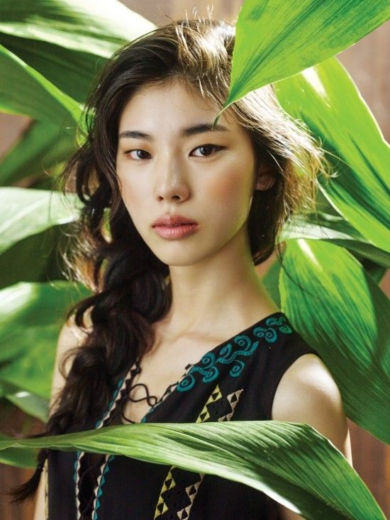
            </td>
            <td>
                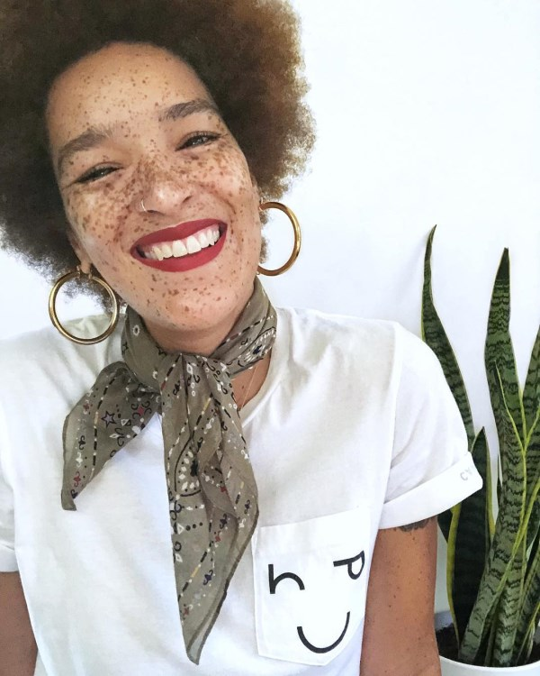
            </td>
            <td>
                
            </td>
            <td>
                
            </td>
            <td>
                
            </td>
        </tr>
    </table>
    <figcaption><i>Fig4. Current training images have noisy information, such as background or objects</i></figcaption>
</figure>

First, there is a lot of unnecessary information in the training images. 
Since we are creating a model to distinguish faces, any information other than the face should not cause confusion. 
For example, in the above image, there are plants next to the two women on the left. 
In this case, if there is not enough training data and there is a plant next to a man, the model might determine that the man has the characteristics of a woman. 
Similarly, all three women on the right are holding mobile phones. 
If the model was trained with such data, it might cause confusion if a man is holding a mobile phone during testing.
Therefore, we need to train our model only with facial data to learn the shape of a person's face. (At least if there isn't enough data to mitigate such features)


### 2. Improved CNN network. 
As we learned in our previous classes, in order to perform such tasks properly, a well-structured CNN network is suggested. 
As submitted in the project proposal, the goal of this project was originally to increase performance by adding and comparing multiple layers of CNN to the UWImg code.

<figure>
    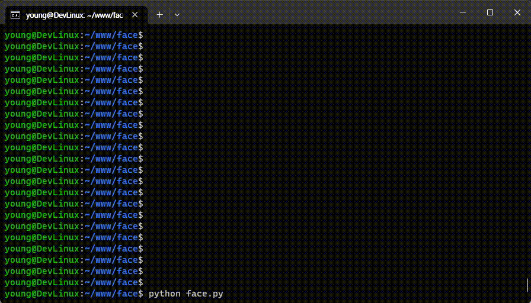
    <figcaption><i>Fig5. Without a GPU, adding another layer and training took too much time! 6 seconds * 1000 iterations = 6000 seconds!</i></figcaption>
</figure>

However, it was not easy to do so in the current structure and too slow.
Up until now, it already took nearly 10~20 minutes to see the results after changing just single parameter. 
Moreover, in this process, adding one layer to the network increased the training time to 100 minutes. 
Therefore, it seemed necessary to choose a development environment that allows GPU learning.


## Change the project environment to Python with Tensorflow

We decided to proceed with the project again in Python, which is more convenient for AI development.
We also had to choose between PyTorch and TensorFlow libraries. 
We decided to try TensorFlow this time because we learned PyTorch in class and using it might unfold in a similar way. 
Also, it seemed more meaningful to try something new.

### 1. Prepare more training and testing images

We gathered better facial images without unnecessary information and performed data cleaning.
After filtering out all unsuitable images for training, we prepared a total of 8,000 images, with 4,000 for men and 4,000 for women including the previously prepared 2,000 images.
As before, we unified the image size and color type to 128x128 with RGB channels.

<figure>
    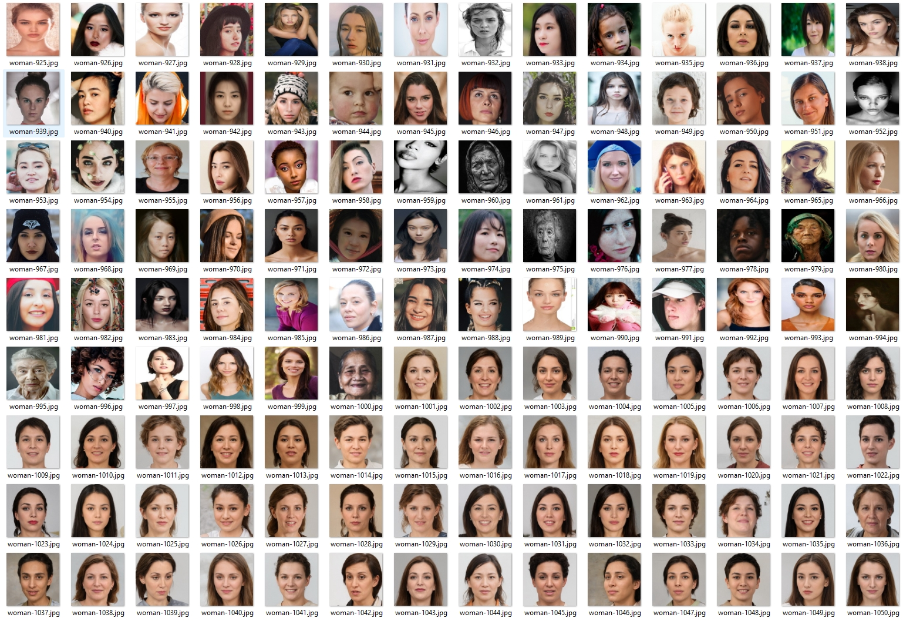
    <figcaption><i>Fig6. The new face dataset for training: https://generated.photos</i></figcaption>
</figure>


### 2. GPU environment setup
Using Colab or Jupyter would be the easiest way to utilize a GPU, but we decided to set up a development environment on the local environment for the purpose of applying this project to actual development in the future.

Since our development environment is Windows OS, there were some inconveniences in setting up the GPU development environment.
In particular, TensorFlow recently discontinued official support for GPU in the Windows Native.
As a result, there were continuous issues with using the latest Python, CUDA, cuDNN, and dependency problems, and eventually, we decided to use an isolated Python environment with Conda as an alternative.
This is the final environment we used for this project. Compatibility can vary depending on the version, so we have noted it below.

- Windows 11 64-bit operating system
- PyCharm 2023.1.2 (https://www.jetbrains.com/pycharm)
- Conda 23.3.1 (https://docs.conda.io/en/main/miniconda.html)
- Python 3.10.10 (Included in Conda)
- Tensorflow 2.10 (https://www.tensorflow.org/install/pip)
- CUDA Toolkit 12.1.1 (https://developer.nvidia.com/cuda-toolkit-archive)
- cuDNN v8.9.0 (https://developer.nvidia.com/rdp/cudnn-archive)

```python
print("Num GPUs Available: ", len(tf.config.list_physical_devices('GPU')))
Num GPUs Available:  1
```


## Training with TensorFlow
In order to minimize any differences, we first implemented the network used in the previous UWImg test as-is in TensorFlow. 

First, the commonly used parameters were set as follows. We used the same image size of 128x128 with RGB channels, and set the BatchSize to 128. The rest used TensorFlow's default values.

```python
params = {
    "DatasetPath": "data/v2",
    "ImageWidth": 128,
    "ImageHeight": 128,
    "ImageChannel": 3,
    "BatchSize": 128,
    "RandomSeed": 0,
    "TestSplitRatio": 0.2,
    "Datasets": ["training", "validation"],
    "ShuffleCount": 100,
    "CacheBufferSize": tf.data.AUTOTUNE,
    "Epochs": 20,
}
```

We then set up a 3-step layer that converts from 128->64->32 using SGD, just like the UWImg test, and trained with the hyper-parameters `learning_rate=0.1, momentum=0.9, decay=0.01`.
The source code for the corresponding model is implemented in the `build_model_v1()` function.

```python
def build_model_v1(params):
    model = Sequential([
        layers.Rescaling(1 / 255, input_shape=(params["ImageWidth"], params["ImageHeight"], params["ImageChannel"])),
        layers.Conv2D(16, 3, padding='same', activation='relu'),
        layers.MaxPooling2D(),
        layers.Conv2D(32, 3, padding='same', activation='relu'),
        layers.MaxPooling2D(),
        layers.Flatten(),
        layers.Dense(len(params["Classes"])),
        layers.Activation("softmax"),
    ])

    optimizer = tf.keras.optimizers.SGD(learning_rate=0.1, momentum=0.9, decay=0.01)
    model.compile(optimizer=optimizer,
                  loss=tf.keras.losses.SparseCategoricalCrossentropy(),
                  metrics=["accuracy"])

    return optimizer, model
```

The overall network configuration is as follows:
```python
Operator : {'name': 'SGD', 'learning_rate': 0.1, 'decay': 0.01, 'momentum': 0.9, 'nesterov': False}

 Layer (type)                       Output Shape              Param #
----------------------------------------------------------------------
 rescaling (Rescaling)              (None, 128, 128, 3)       0         
 conv2d (Conv2D)                    (None, 128, 128, 16)      448       
 max_pooling2d (MaxPooling2D)       (None, 64, 64, 16)        0         
 conv2d_1 (Conv2D)                  (None, 64, 64, 32)        4640      
 max_pooling2d_1 (MaxPooling2D)     (None, 32, 32, 32)        0         
 flatten (Flatten)                  (None, 32768)             0         
 dense (Dense)                      (None, 2)                 65538     
 activation (Activation)            (None, 2)                 0
```

Thanks to the GPU, the training proceeded very quickly without waiting for dozens of minutes. 
As a result, we successfully reproduced similar loss and accuracy to the previous UWImg test. 
The loss value for the UWImg test was `0.6931`, while in TensorFlow, it was `0.6932`, which was almost identical.
The accuracy appeared to be around `50%`, which was also almost identical to the first UWImg test.

```shell
- Evaluate the model.
Epoch 1/20
38/38 [==============================] - 4s 18ms/step - loss: 49.3572 - accuracy: 0.5002 - val_loss: 0.6939 - val_accuracy: 0.4950
Epoch 2/20
38/38 [==============================] - 0s 10ms/step - loss: 0.6955 - accuracy: 0.4904 - val_loss: 0.6948 - val_accuracy: 0.5050
...
Epoch 19/20
38/38 [==============================] - 0s 10ms/step - loss: 0.6933 - accuracy: 0.4967 - val_loss: 0.6932 - val_accuracy: 0.4950
Epoch 20/20
38/38 [==============================] - 0s 10ms/step - loss: 0.6932 - accuracy: 0.4954 - val_loss: 0.6932 - val_accuracy: 0.4950
```

<figure>
    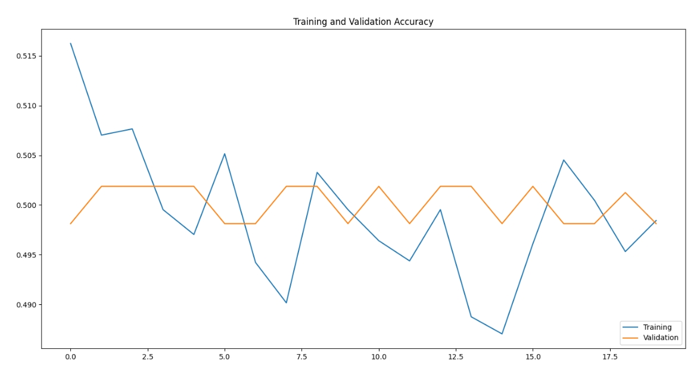
    <figcaption><i>Fig7. The first TensorFlow test graph appears almost identical to the first UWImg test.</i></figcaption>
</figure>


## Adjusting hyper-parameters

### 1. Using slower learning rate, lower decay, and more epoch cycles.

To solve the problem of the previous network, where learning was not happening at all, we changed the hyperparameters.
In particular, the learning rate was too large, causing significant bouncing. 
We reduced the learning rate and proportionally reduced the decay as well.

Additionally, to increase the learning accuracy, we raised the epoch cycle and lowered the batch size, as there was no need for it to be any higher thanks to the GPU performance, to 32. 
In other words, all parameters were focused on increasing accuracy.

The source code for the corresponding model is implemented in the `build_model_v2()` function.

```python
def build_model_v2(params):
    model = Sequential([
        layers.Rescaling(1 / 255, input_shape=(params["ImageWidth"], params["ImageHeight"], params["ImageChannel"])),
        layers.Conv2D(16, 3, padding='same', activation='relu'),
        layers.MaxPooling2D(),
        layers.Conv2D(32, 3, padding='same', activation='relu'),
        layers.MaxPooling2D(),
        layers.Flatten(),
        layers.Dense(len(params["Classes"])),
        layers.Activation("softmax"),
    ])

    optimizer = tf.keras.optimizers.SGD(learning_rate=0.01, momentum=0.9, decay=0.001)
    model.compile(optimizer=optimizer,
                  loss=tf.keras.losses.SparseCategoricalCrossentropy(),
                  metrics=["accuracy"])

    return optimizer, model
```
```python
{'name': 'SGD', 'learning_rate': 0.01, 'decay': 0.001, 'momentum': 0.9, 'nesterov': False}

 Layer (type)                    Output Shape              Param #   
===================================================================
 rescaling (Rescaling)           (None, 128, 128, 3)       0         
 conv2d (Conv2D)                 (None, 128, 128, 16)      448       
 max_pooling2d (MaxPooling2D)    (None, 64, 64, 16)        0         
 conv2d_1 (Conv2D)               (None, 64, 64, 32)        4640      
 max_pooling2d_1 (MaxPooling2D)  (None, 32, 32, 32)        0
 flatten (Flatten)               (None, 32768)             0         
 dense (Dense)                   (None, 2)                 65538
 activation (Activation)         (None, 2)                 0
```

As a result, the accuracy increased to an average of `88.5%`, but the network showed severe overfitting.
The accuracy of the training data reached `99.8%`, which is too much accurate.

```shell
...
Epoch 49/50
200/200 [==============================] - 1s 3ms/step - loss: 0.0085 - accuracy: 0.9989 - val_loss: 0.5708 - val_accuracy: 0.8850
Epoch 50/50
200/200 [==============================] - 1s 3ms/step - loss: 0.0090 - accuracy: 0.9983 - val_loss: 0.5780 - val_accuracy: 0.8863
```

<figure>
    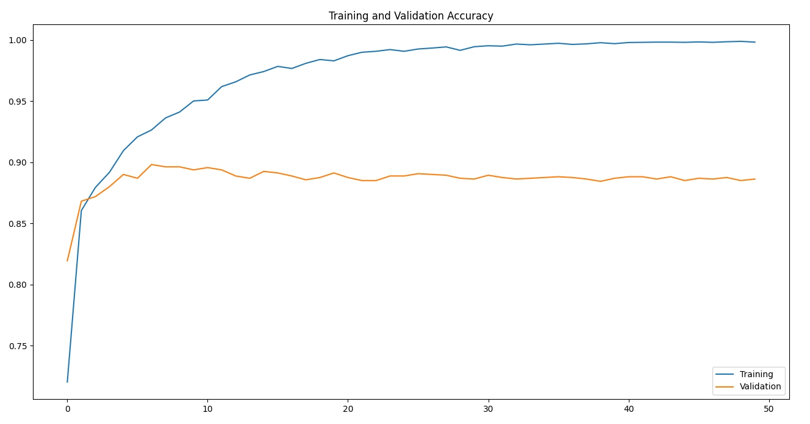
    <figcaption><i>Fig8. The first TensorFlow test graph appears almost identical to the first UWImg test.</i></figcaption>
</figure>


### 2. Use the Adam optimizer

Instead of additional adjusting the detailed hyperparameters by ourselves, we decided to try using Adam (Adaptive Moment Estimation) operator for the network, which is recommended as the default optimizer in TensorFlow. 
This is because the algorithm is optimized, and it has the feature of automatically adjusting parameters.

We did not change any other hyperparameters or networks from the last test. 
The source code for the corresponding model is implemented in the `build_model_v3()` function.

```python
def build_model_v3(params):
    model = Sequential([
        layers.Rescaling(1 / 255, input_shape=(params["ImageWidth"], params["ImageHeight"], params["ImageChannel"])),
        layers.Conv2D(16, 3, padding='same', activation='relu'),
        layers.MaxPooling2D(),
        layers.Conv2D(32, 3, padding='same', activation='relu'),
        layers.MaxPooling2D(),
        layers.Flatten(),
        layers.Dense(len(params["Classes"])),
        layers.Activation("softmax"),
    ])

    optimizer = tf.keras.optimizers.Adam(learning_rate=0.001, decay=0.0001)
    model.compile(optimizer=optimizer,
                  loss=tf.keras.losses.SparseCategoricalCrossentropy(),
                  metrics=["accuracy"])

    return optimizer, model
```

As a result, the same overfitting pattern was shown, but the accuracy increased to an average of `90.5%`. 
The automatic optimization feature of the optimizer did not solve the overfitting issue.

```shell
...
Epoch 49/50
200/200 [==============================] - 1s 3ms/step - loss: 0.0083 - accuracy: 0.9986 - val_loss: 0.4614 - val_accuracy: 0.9075
Epoch 50/50
200/200 [==============================] - 1s 3ms/step - loss: 0.0078 - accuracy: 0.9987 - val_loss: 0.4441 - val_accuracy: 0.9031
```

<figure>
    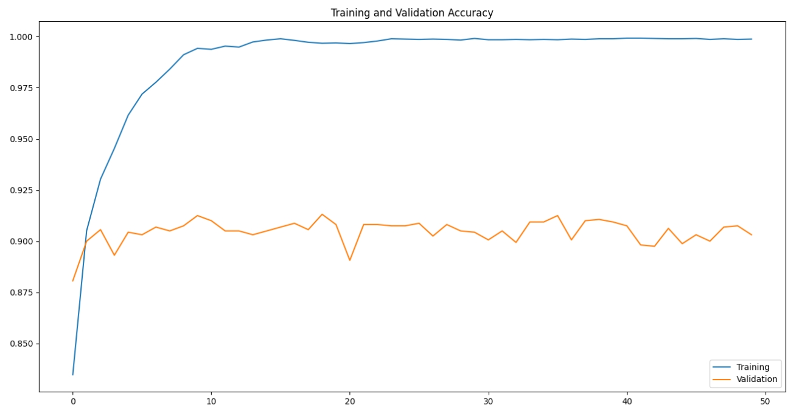
    <figcaption><i>Fig9. Even when applying the Adam optimizer, severe overfitting was observed..</i></figcaption>
</figure>


## Trying to solve overfitting

### 1. Adjusting the network and hyperparameters

We decided to additionally adjust the network and hyperparameters.

First of all, because the current learning data consisted of a mixture of the first unrefined dataset and the second dataset with only faces refined, the first dataset and the second dataset had a relatively large difference in accuracy.
Therefore, in order to improve the average accuracy, we added one more convolution layer and adjusted the kernel and stride size so that the first dataset and the second dataset could have similar levels of learning accuracy.

Now, to solve the overfitting issue, we used a large dense size and added dropout to regularize the randomly learned data. 
Additionally, we reduced the epoch cycles back to 20 to prevent overly deep learning. 
Also, since the softmax had little significance, we removed it.
The source code for the corresponding model is implemented in the `build_model_v4()` function.

```python
def build_model_v4(params):
    model = Sequential([
        layers.Rescaling(1 / 255, input_shape=(params["ImageWidth"], params["ImageHeight"], params["ImageChannel"])),
        layers.Conv2D(64, kernel_size=(5, 5), strides=(2, 2), padding='same', activation='relu'),
        layers.MaxPooling2D(),
        layers.Conv2D(128, kernel_size=(3, 3), strides=(2, 2), padding='same', activation='relu'),
        layers.MaxPooling2D(),
        layers.Conv2D(256, kernel_size=(2, 2), strides=(1, 1), padding='same', activation='relu'),
        layers.MaxPooling2D(),
        layers.Flatten(),
        layers.Dense(256, activation='relu'),
        layers.Dropout(0.5),
        layers.Dense(128, activation='relu'),
        layers.Dropout(0.5),
        layers.Dense(64, activation='relu'),
        layers.Dropout(0.5),
        layers.Dense(len(params["Classes"])),
    ])

    optimizer = tf.keras.optimizers.Adam(learning_rate=0.0001, decay=0.0001)
    model.compile(optimizer=optimizer,
                  loss=tf.keras.losses.SparseCategoricalCrossentropy(from_logits=True),
                  metrics=["accuracy"])

    return optimizer, model
```

The overall network configuration is as follows:

```python
{'name': 'Adam', 'learning_rate': 0.0001, 'decay': 0.0001, 'beta_1': 0.9, 'beta_2': 0.999, 'epsilon': 1e-07, 'amsgrad': False}

 Layer (type)                     Output Shape             Param #   
========================================================================
 rescaling (Rescaling)           (None, 128, 128, 3)       0         
 conv2d (Conv2D)                 (None, 64, 64, 64)        4864      
 max_pooling2d (MaxPooling2D)    (None, 32, 32, 64)        0         
 conv2d_1 (Conv2D)               (None, 16, 16, 128)       73856     
 max_pooling2d_1 (MaxPooling2D)  (None, 8, 8, 128)         0         
 conv2d_2 (Conv2D)               (None, 8, 8, 256)         131328    
 max_pooling2d_2 (MaxPooling2D)  (None, 4, 4, 256)         0         
 flatten (Flatten)               (None, 4096)              0         
 dense (Dense)                   (None, 256)               1048832   
 dropout (Dropout)               (None, 256)               0         
 dense_1 (Dense)                 (None, 128)               32896     
 dropout_1 (Dropout)             (None, 128)               0         
 dense_2 (Dense)                 (None, 64)                8256      
 dropout_2 (Dropout)             (None, 64)                0         
 dense_3 (Dense)                 (None, 2)                 130       
```

As a result, the training accuracy dropped to `97%`, and the test accuracy increased to an average of `92%`.
Although the training accuracy was still high, the overfitting was gradually being resolved.

```shell
...
Epoch 19/20
200/200 [==============================] - 1s 4ms/step - loss: 0.0860 - accuracy: 0.9709 - val_loss: 0.2150 - val_accuracy: 0.9181
Epoch 20/20
200/200 [==============================] - 1s 4ms/step - loss: 0.0811 - accuracy: 0.9720 - val_loss: 0.2156 - val_accuracy: 0.9287
```

<figure>
    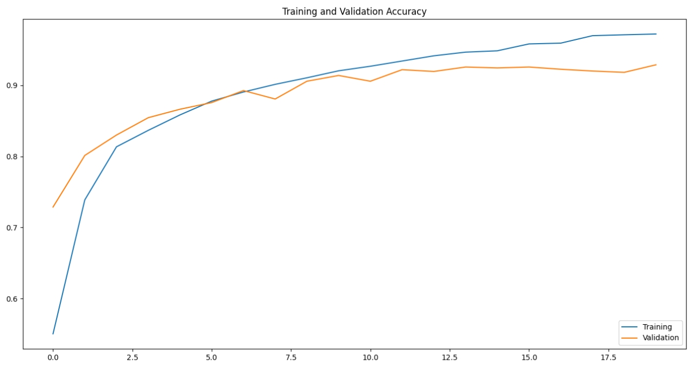
    <figcaption><i>Fig10. By adjusting the network, the overfitting was gradually being resolved.</i></figcaption>
</figure>


### Using decay stepping, data augmentation, and weight regularizer

Through researching overfitting, we were able to discover several advanced techniques being used.
We decided to try using options decay stepping, data augmentation, and weight regularizer.

First, we used an optimizer scheduler to gradually increase the decay as the number of epochs increases.
We applied the most appropriate values through multiple tests, `initial_learning_rate = 0.0001`, `decay_steps = Epochs * 10`, and `decay_rate = 0.0001`.

For the second approach, data augmentation, we applied a method that involves flipping and rotating the data for training.
Especially, the second dataset is a very homogenized dataset created by artificial intelligence, which led to severe overfitting.
We anticipated that this random data transformation would be helpful.

Lastly, we set the L2 regularizer to be applied as well as higher dense units because this "Combined Regulation" model, which applies both Dropout and L2 Regularizer, is generally recommended by TensorFlow for being effective against overfitting.

The source code for the corresponding model is implemented in the `build_model_v5()` function.

```python
def build_model_v5(params):
    model = Sequential([
        layers.Rescaling(1 / 255, input_shape=(params["ImageWidth"], params["ImageHeight"], params["ImageChannel"])),
        layers.RandomFlip('horizontal'),
        layers.RandomRotation(0.1),
        layers.Conv2D(128, kernel_size=(5, 5), strides=(2, 2), padding='same', activation='relu'),
        layers.MaxPooling2D(),
        layers.Conv2D(256, kernel_size=(3, 3), strides=(2, 2), padding='same', activation='relu'),
        layers.MaxPooling2D(),
        layers.Conv2D(512, kernel_size=(2, 2), strides=(2, 2), padding='same', activation='relu'),
        layers.MaxPooling2D(),
        layers.Flatten(),
        layers.Dense(512, activation='relu', kernel_regularizer=regularizers.l2(0.001)),
        layers.Dropout(0.3),
        layers.Dense(512, activation='relu', kernel_regularizer=regularizers.l2(0.001)),
        layers.Dropout(0.3),
        layers.Dense(512, activation='relu', kernel_regularizer=regularizers.l2(0.001)),
        layers.Dropout(0.3),
        layers.Dense(len(params["Classes"])),
    ])

    schedule = tf.keras.optimizers.schedules.InverseTimeDecay(initial_learning_rate=0.0001,
                                                              decay_steps=params["Epochs"] * 10,
                                                              decay_rate=0.0001,
                                                              staircase=False)

    optimizer = tf.keras.optimizers.Adam(schedule)
    model.compile(optimizer=optimizer,
                  loss=tf.keras.losses.SparseCategoricalCrossentropy(from_logits=True),
                  metrics=["accuracy"])

    return optimizer, model
```

```python
{'name': 'Adam', 'decay': 0.0, 'beta_1': 0.9, 'beta_2': 0.999, 'epsilon': 1e-07, 'amsgrad': False, 
 'learning_rate': {
     'class_name': 'InverseTimeDecay',
     'config': { 'initial_learning_rate': 0.0001, 'decay_steps': 500, 'decay_rate': 0.0001, 'staircase': False, 'name': None }
 }

 Layer (type)                       Output Shape              Param #   
=========================================================================
 rescaling (Rescaling)              (None, 128, 128, 3)       0         
 random_flip (RandomFlip)           (None, 128, 128, 3)       0         
 random_rotation (RandomRotation)   (None, 128, 128, 3)       0         
 conv2d (Conv2D)                    (None, 64, 64, 128)       9728      
 max_pooling2d (MaxPooling2D)       (None, 32, 32, 128)       0         
 conv2d_1 (Conv2D)                  (None, 16, 16, 256)       295168    
 max_pooling2d_1 (MaxPooling2D)     (None, 8, 8, 256)         0         
 conv2d_2 (Conv2D)                  (None, 4, 4, 512)         524800    
 max_pooling2d_2 (MaxPooling2D)     (None, 2, 2, 512)         0         
 flatten (Flatten)                  (None, 2048)              0         
 dense (Dense)                      (None, 512)               1049088   
 dropout (Dropout)                  (None, 512)               0         
 dense_1 (Dense)                    (None, 512)               262656    
 dropout_1 (Dropout)                (None, 512)               0         
 dense_2 (Dense)                    (None, 512)               262656    
 dropout_2 (Dropout)                (None, 512)               0         
 dense_3 (Dense)                    (None, 2)                 1026      
```

Ultimately, we were able to further resolve some overfitting and raise the accuracy to an average of `93.5%`.

```shell
...
Epoch 49/50
200/200 [==============================] - 9s 45ms/step - loss: 0.1160 - accuracy: 0.9697 - val_loss: 0.2318 - val_accuracy: 0.9337
Epoch 50/50
200/200 [==============================] - 9s 45ms/step - loss: 0.1122 - accuracy: 0.9694 - val_loss: 0.2018 - val_accuracy: 0.9375
```

<figure>
    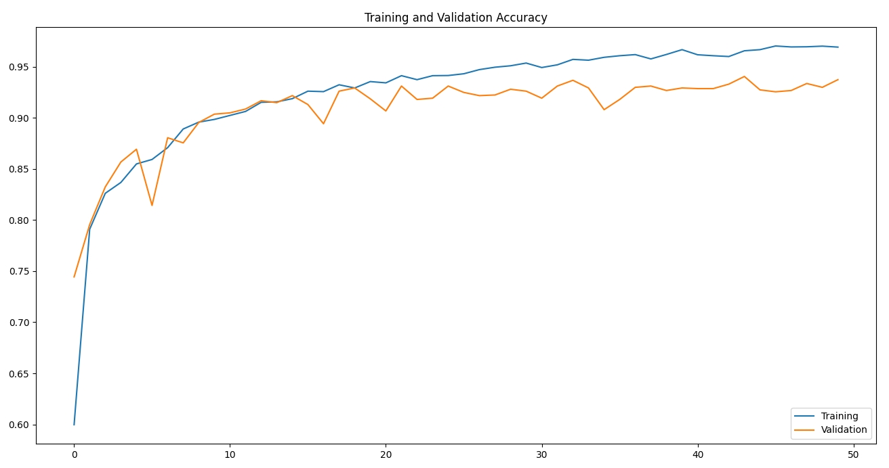
    <figcaption><i>Fig11. By applying various anti-overfitting techniques, overfitting was further resolved.</i></figcaption>
</figure>


## Conclusion

Through vision machine learning, we successfully increased the accuracy from an initial `52%` to a final `93.5%`.

The most significant learning point of our project was the importance of training data. Ultimately, the solution to overfitting also involved changing the training data at its sources or result.
Particularly, for even higher accuracy, it seemed necessary to have a larger and more diverse set of training data as well as more refined images about faces and specific features for a particular gender, such as clothing style or makeup.

Through this project, we are glad to have learned the basic usage of CNN machine learning, such as visual recognition. We look forward to applying this knowledge to various projects in the future.

